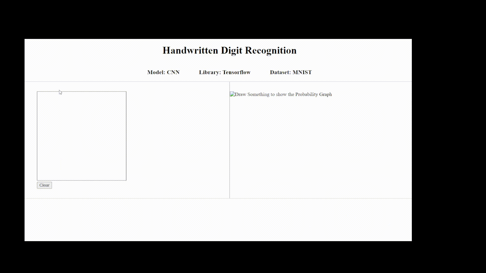

# Hand Written Digit Recognition

## Description

This is a Flask web application project for hand-written digit recognition, utilizing a TensorFlow-based Convolutional Neural Network (CNN) model. The app enables users to draw a digit on a canvas using their mouse or touch input and then predicts the drawn digit using the trained CNN model. The app also displays a probability graph, indicating the model's confidence in its prediction within the range of 0 to 9.

## Table of Contents

-  [Installation](#installation)
-  [Usage](#usage)
-  [Demo](#demo)

## Installation

To run this project, follow these steps:

1.  Clone the repository:
    ```
    git clone [repository_url]
    cd flask-project
    ``` 
    
3.  Create a virtual environment (optional, but recommended):
    ```
    python -m venv venv
    source venv/bin/activate   # For Windows, use: venv\Scripts\activate
    ```
    
4.  Install the dependencies:
    ```
    pip install -r requirements.txt
    ```
    
5.  Run the Flask application:
    ```
    python app.py
    ```
    
## Usage

After running the Flask application, open your web browser and go to `http://localhost:5000` to access the web application. 

## Demo

